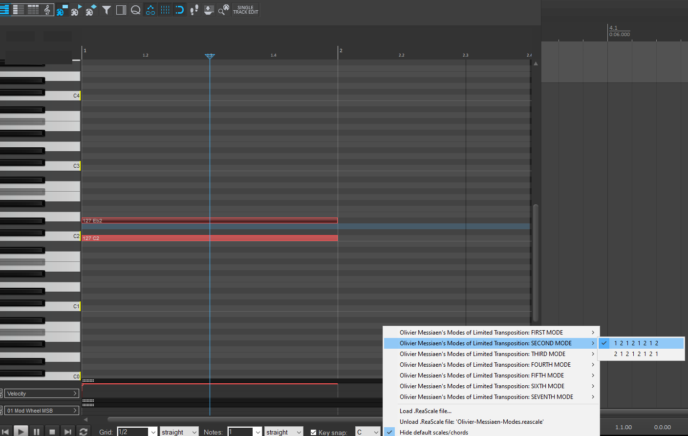

# Olivier-Messiaen-Modes

I created this repo to share my [Olivier-Messiaen-Modes.reascale](Olivier-Messiaen-Modes.reascale)
 to enable the Olivier Messiaen's Modes of limited transposition in [REAPER](https://www.reaper.fm/) DAW.

 
## Olivier Messiaen's Modes of Limited Transposition: Structural Overview

| Mode    | --- Intervals in Semitones --- | Number of Notes | Number of Transpositions | Number of Modes (Shifts) | Description |
|---------|----------------------------- |-----------------|--------------------------|--------------------------|-------------|
| FIRST   | 2  2  2  2  2  2             | 6               | 2                        | 1                        | Whole-tone scale. Divided into six groups of two notes each. |
| SECOND  | <nobr>1  2  1  2  1  2  1  2  2  1  2  1  2  1  2  1</nobr> | 8               | 3                        | 2                        | Octatonic, diminished, whole-half, or half-whole scale. Divided into four groups of three notes each. |
| THIRD   | 2  1  1  2  1  1  2  1  1  1  1  2  1  1  2  1  1  2 1  2  1  1  2  1  1  2  1    | 9               | 4                        | 3                        | Divided into three groups of three notes each. |
| FOURTH  | 1  1  3  1  1  1  3  1  1  3  1  1  1  3  1  1 3  1  1  1  3  1  1  1 1  1  1  3  1  1  1  3       | 8               | 6                        | 4                        | Contains semitones and minor thirds. |
| FIFTH   | 1  4  1  1  4  1  4  1  1  4  1  1 1  1  4  1  1  4             | 6               | 6                        | 3                        | Contains semitones and major thirds. |
| SIXTH   | 2  2  1  1  2  2  1  1  2  1  1  2  2  1  1  2 1  1  2  2  1  1  2  2 1  2  2  1  1  2  2  1   | 8               | 6                        | 4                        | Contains tones and semitones. |
| SEVENTH | <nobr>1  1  1  2  1  1  1  1  2  1  1  1  2  1  1  1  1  2  1  1 1  2  1  1  1  1  2  1  1  1 2  1  1  1  1  2  1  1  1  1 1  1  1  1  2  1  1  1  1  2</nobr> | 10              | 6                        | 5                        | Contains semitones and tones. Most complex pattern. |

This table presents a comprehensive overview of Olivier Messiaen's seven Modes of Limited Transposition, a fundamental concept in his musical language and compositional technique. Each row in the table represents one of Messiaen's modes, numbered from 1 to 7, and provides detailed structural information about each mode:

- Mode: The identifying number of each mode.
- Intervals in Semitones: The specific interval pattern that defines each mode, expressed in semitones.
- Number of Notes: The total number of unique pitches in each mode.
- Number of Transpositions: How many unique transpositions exist for each mode before it repeats its initial form.
- Number of Modes (Shifts): The number of unique rotations or shifts possible within each mode.
- Description: A brief characterization of each mode, including common names (where applicable) and notable structural features.

The table progresses from the simplest mode (Mode 1, the whole-tone scale) to the most complex (Mode 7). It illustrates the increasing complexity and asymmetry in Messiaen's system, showcasing how these modes break away from traditional diatonic scales. This structural analysis provides insight into the unique tonal and harmonic possibilities that these modes offered Messiaen and other composers who adopted them, fundamentally influencing 20th and 21st-century musical composition and theory.

## REAPER Scale Implementation of Olivier Messiaen's Modes of Limited Transposition

The Olivier-Messiaen-Modes.reascale file is a specialized scale definition file for REAPER, a digital audio workstation (DAW). This file encodes Olivier Messiaen's seven Modes of Limited Transposition, providing a practical tool for musicians and composers working with these unique harmonic structures in a digital environment.
Key features of this file include:

- Comprehensive Coverage: All seven of Messiaen's modes are represented, from the simplest (Mode 1, the whole-tone scale) to the most complex (Mode 7).
- Detailed Labeling: Each mode is clearly labeled with its number and interval structure (e.g., "Mode 1 2-2-2-2-2-2").
- Numeric Encoding: The modes are encoded using REAPER's numeric system, where each digit represents a semitone step in the scale.
- Metadata: The file includes version information and authorship details, indicating ongoing development and refinement.
- Educational Comments: Each mode is preceded by comments detailing its structural characteristics, including the number of notes, transpositions, and shifts, as well as a brief description.
- Base Implementation: This version (0.2) provides the basic form of each mode without shifts or transpositions, serving as a foundation for further development.

This .reascale file serves as both a practical tool for implementing Messiaen's modes in REAPER-based compositions and as an educational resource for understanding the structure of these influential 20th-century harmonic innovations. It bridges music theory and digital music production, making Messiaen's complex modal system more accessible to modern composers and producers.

## References

- [The Technique of My Musical Language (translated in English)](https://monoskop.org/images/5/50/Messiaen_Olivier_The_Technique_of_My_Musical_Language.pdf)
- [wikipedia page](https://en.wikipedia.org/wiki/Mode_of_limited_transposition)
- [Rick Beato's introductory youtube video](https://www.youtube.com/watch?v=nCXxV7eDEPc)
- [Related Reaper Forum Thread](https://forum.cockos.com/showthread.php?p=2807156#post2807156)

---
