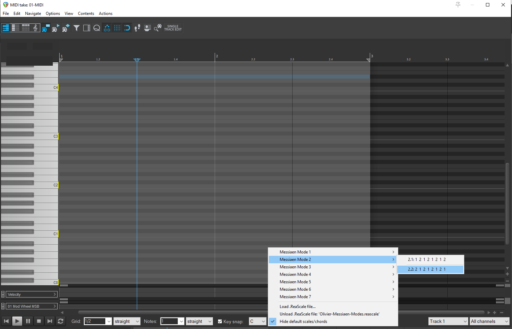

# Olivier Messiaen Modes

I created this repo to share my [Olivier-Messiaen-Modes.reascale](Olivier-Messiaen-Modes.reascale)
enabling the Olivier Messiaen's Modes of limited transposition in [REAPER](https://www.reaper.fm/) DAW.

## Olivier Messiaen's Modes of Limited Transposition

Certainly, I'll update the table as requested, splitting the "Intervals in Semitones (Grouped)" column into two separate columns: "Shft Id" and "Intervals in Semitones". Here's the updated table:

### Mode 1
Whole-tone scale. 6 Notes, 1 Shift, 2 Transpositions.

| Id | Intervals in Semitones | Shift |
|:--------|:-----------------------|---------------|
| 1.1     | `2 2 2 2 2 2`          | Root (unique) position |

### Mode 2
Octatonic, diminished, whole-half, or half-whole scale. 8 Notes, 2 Shifts, 3 Transpositions.
| Id | Intervals in Semitones | Shift |
|:--------|:-----------------------|:---------------|
| 2.1     | `1 2 1 2 1 2 1 2`      | Root position  |  
| 2.2     | `2 1 2 1 2 1 2 1`      | First shift (left)    |

### Mode 3
Contains tones and semitones. 9 Notes, 3 Shifts, 4 Transpositions.
| Id | Intervals in Semitones | Shift |
|:--------|:-----------------------||:---------------|
| 3.1     | `2 1 1 2 1 1 2 1 1`    | Root position              | 
| 3.2     | `1 1 2 1 1 2 1 1 2`    | First shift (left)               |
| 3.3     | `1 2 1 1 2 1 1 2 1`    | Second shift (left)               | 

### Mode 4
Contains semitones and minor thirds
| Id | Intervals in Semitones | Notes | Shifts | Transpositions |
|:--------|:-----------------------|:------|:-------|:---------------|
| 4.1     | `1 1 3 1 1 1 3 1`      | 8     | 4      | 6              | 
| 4.2     | `1 3 1 1 1 3 1 1`      |       |        |                | 
| 4.3     | `3 1 1 1 3 1 1 1`      |       |        |                |
| 4.4     | `1 1 1 3 1 1 1 3`      |       |        |                |

### Mode 5
Contains semitones and major thirds
| Id | Intervals in Semitones | Notes | Shifts | Transpositions |
|:--------|:-----------------------|:------|:-------|:---------------|
| 5.1     | `1 4 1 1 4 1`          | 6     | 3      | 6              | 
| 5.2     | `4 1 1 4 1 1`          |       |        |                | 
| 5.3     | `1 1 4 1 1 4`          |       |        |                | 

### Mode 6
 Contains tones and semitones
| Id | Intervals in Semitones | Notes | Shifts | Transpositions | 
|:--------|:-----------------------|:------|:-------|:---------------|
| 6.1     | `2 2 1 1 2 2 1 1`      | 8     | 4      | 6              |
| 6.2     | `2 1 1 2 2 1 1 2`      |       |        |                |
| 6.3     | `1 1 2 2 1 1 2 2`      |       |        |                |
| 6.4     | `1 2 2 1 1 2 2 1`      |       |        |                |

### Mode 7
Contains semitones and tones. Most complex pattern
| Id | Intervals in Semitones | Notes | Shifts | Transpositions |
|:--------|:-----------------------|:------|:-------|:---------------|
| 7.1     | `1 1 1 2 1 1 1 1 2 1`  | 10    | 5      | 6              |
| 7.2     | `1 1 2 1 1 1 1 2 1 1`  |       |        |                |
| 7.3     | `1 2 1 1 1 1 2 1 1 1`  |       |        |                |
| 7.4     | `2 1 1 1 1 2 1 1 1 1`  |       |        |                |
| 7.5     | `1 1 1 1 2 1 1 1 1 2`  |       |        |                |

Legend:
- Id: Identifier for each unique shift or rotation within a mode
- Intervals in Semitones: Sequence of intervals between consecutive notes in semitones
- Notes: Total number of distinct pitches in the mode
- Shifts: Number of unique rotations within each mode
- Transpositions: Number of distinct starting pitches before the pattern repeats

To understand how I create the .reascale file, see [reascale_format.md](reascale_format.md).

## Todo 
In the dpocument [chords_in_modes.md](chords_in_modes.md) I reported for each mode, which chord are popssible, using Lokasenna Theory Helper REAPER plugin. 
A possible works to do in futire is adding this (and other possible) chords in the .reascale file.

## References

- [The Technique of My Musical Language (translated in English)](https://monoskop.org/images/5/50/Messiaen_Olivier_The_Technique_of_My_Musical_Language.pdf)
- [wikipedia page](https://en.wikipedia.org/wiki/Mode_of_limited_transposition)
- [Rick Beato's introductory youtube video](https://www.youtube.com/watch?v=nCXxV7eDEPc)
- [Related Reaper Forum Thread](https://forum.cockos.com/showthread.php?p=2807156#post2807156)

## 🙏 Status / How to contribute

This project is work-in-progress proof-of-concept draft version.

Any contribute or suggestion is welcome.
For any proposal and issue, please submit here on github issues for bugs, suggestions, etc.
You can also contact me via email (giorgio.robino@gmail.com).

**IF YOU LIKE THE PROJECT, PLEASE ⭐️STAR THIS REPOSITORY TO SHOW YOUR SUPPORT!**

[top](/#)

---
