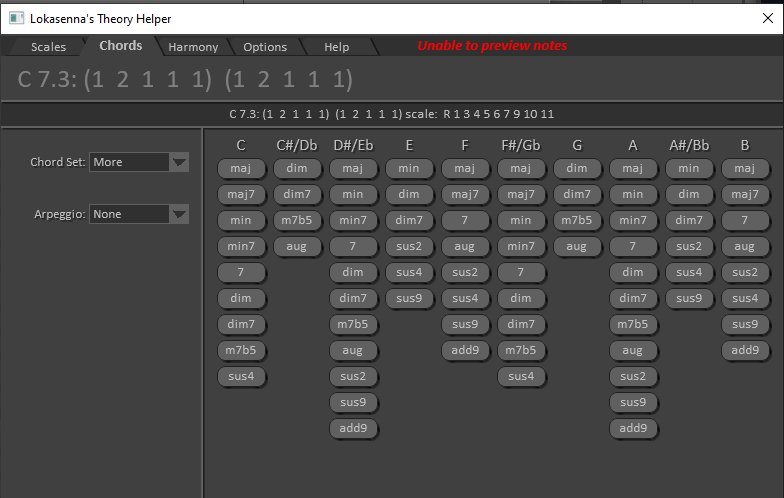

# How to Set Up Mode-Related Chords (Work in Progress)

I would like to extend the `.reascale` file to include a valid set of chords for each mode.  
This is not a trivial task because each of Messiaen's modes can contain many possible chords.  
Below, I've inserted screenshots of all potential chords for each mode, as proposed by the excellent REAPER plugin utility *Lokasenna Theory Helper*.

To create chords in the REAPER MIDI editor, one approach could be the one explained here:  
[How to Quickly Stack Fixed Intervals](https://forum.cockos.com/showthread.php?t=294172)

## Lokasenna Theory Helper Proposed Chords 

### Messiaen Mode 1: all possible chords 
  

###  Messiaen Mode 2: all possible chords

### Messiaen Mode 3: all possible chords

### Messiaen Mode 4: all possible chords

### Messiaen Mode 5: all possible chords

### Messiaen Mode 6: all possible chords

### Messiaen Mode 7: all possible chords

---
---
