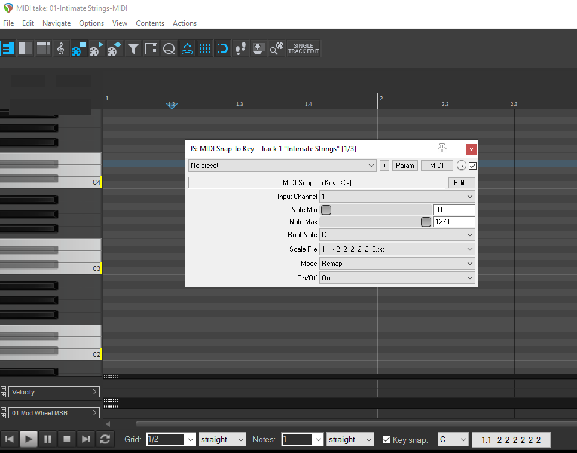

# Play, Recording and Editing Tips

## Play & Recording 

You do need to have ix_scale format corresponding to the .reascale. Please note these formats are different. I already created all ix_scales fro Messian's modes. these alre contained in the ix_scales in this repo.

Here the steps:

1. Set the reascale mode, e.g. `1.1 - 2 2 2 2 2 2`   
2. Run the `JS: MIDI Snap to key` REAPER plugin setting it to run in the key note and the scale (corresponding to that one I previously with reascale), so to select the whole-tone scale (mode 1) in the key of C, you select `1.1 - 2 2 2 2 2 2.txt`
3. Play pr record a MIDI instrument and the played notes fit the grid of allowed notes (in this case the whole note scale in the key of C).

## Editing
You can edit a recorded items forcing to snap notes in the desired mode, just using the REAPER MIDI action: `Force selected notes in key signature`. See the great [Kenny Gioia's explanation](https://www.youtube.com/watch?v=dRN5NToxBlw&t=19s)

- References  
  - https://forum.cockos.com/showthread.php?t=294376
  - https://www.youtube.com/watch?v=dRN5NToxBlw&t=19s 
