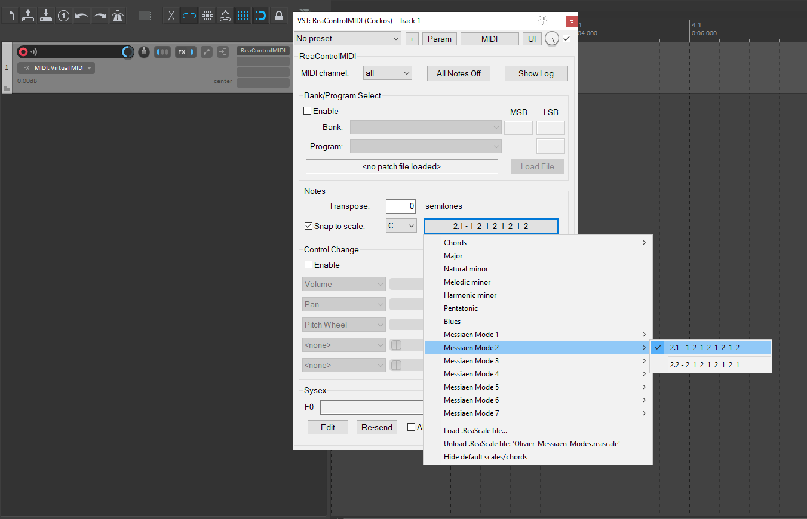

# Play, Recording and Editing Tips

Please note that when you set a .reascale file in REAPER, it only affects the piano roll key colorization, showing disabled keys (those outside the set scale) in grey. However, there are no other practical consequences—you can still play and record any key, even if it’s outside the scale you’ve set with 'snap to grid' in the MIDI editor.

To help with playing, recording, and editing, two different REAPER stock plugins come in handy: `VST: ReaControlMIDI (Cockos)` and `JS: MIDI Snap To Key`.

## Playing & Recording 

To force all notes played (or recorded) to snap to the selected scale (or mode in this case), you can opt for two possible plugins.

### Using `VST: ReaControlMIDI (Cockos)` plugin

Here the steps:
- Set the reascale mode, e.g. `2.1 - 1 2 1 2 1 2 1 2`   
- Run the `VST: ReaControlMIDI (Cockos)` REAPER plugin setting it to run in the key note and the scale (corresponding to that one I previously with reascale), so to select the whole-tone scale (mode 1) in the key of C, you select `1.1 - 2 2 2 2 2 2`
- Play pr record a MIDI instrument and the played notes fit the grid of allowed notes (in this case the whole note scale in the key of C).

### Using `JS: MIDI Snap To Key` plugin 

You do need to have ix_scale format corresponding to the .reascale. Please note these formats are different. I already created all ix_scales fro Messian's modes. these alre contained in the [ix_scales](ix_scales/) in this repo.

Here the steps:
- Set the reascale mode, e.g. `1.1 - 2 2 2 2 2 2`   
- Run the `JS: MIDI Snap to key` REAPER plugin setting it to run in the key note and the scale (corresponding to that one I previously with reascale), so to select the whole-tone scale (mode 1) in the key of C, you select `1.1 - 2 2 2 2 2 2.txt`
- Play pr record a MIDI instrument and the played notes fit the grid of allowed notes (in this case the whole note scale in the key of C).

## Editing

You can edit a recorded items forcing to snap notes in the desired mode, just using the REAPER MIDI action: `Force selected notes in key signature`. See the great Kenny Gioia's youtube video explanation:

- References  
  - https://forum.cockos.com/showthread.php?t=294376
  - https://forum.cockos.com/showthread.php?p=2808897#post2808897
  - https://www.youtube.com/watch?v=dRN5NToxBlw&t=19s 

---
